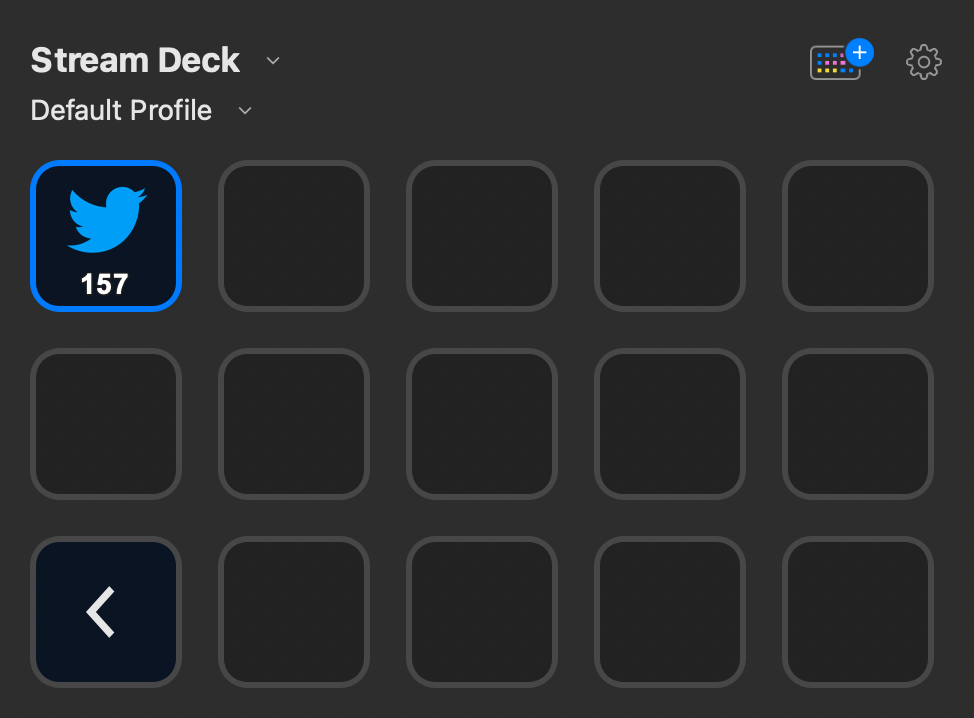

# Stream Deck Twitter Plugin

This plugin shows the number of followers of a given Twitter handle.

As we don't want the user to enter its user credentials or a developer token we are using the CDN endpoint that is also
used to feed Twitter buttons.

## Release Notes

- *0.1 Proof of Concept*
    - Data is fetched every minute via the Twitter API.
    - Twitter handle is hard coded
    - If the follower number increases 30 seconds long a new image will be shown

## Future

- Use [Property Inspector](https://developer.elgato.com/documentation/stream-deck/sdk/property-inspector/) to set the
  Twitter handle